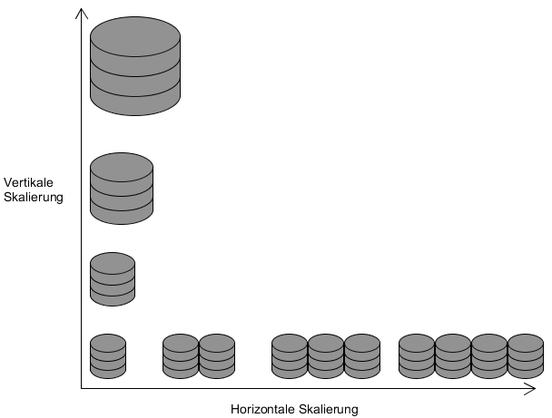

# Einführung

* CAP-Theorem/BASE/ACID
* Skalierung
	* Vertikal
	* Horizontal
* Replication
* Sharding
* Clustering
* Hashing
* Map-Reduce
* In Memory Datenbanken

## ACID/BASE/CAP-Theorem
### ACID [1-2,12-23]

### CAP []

### BASE []

## Skalierung [2-7]
Unter Skalieren versteht man die Eigenschaft eines Systems, sich an verändernde (meist wachsende) Ansprüche anzupassen. Im Bereich der Datenbanken kann beispielsweise der verfügbare Speicherplatz oder die Zugriffsgeschwindigkeit auf Daten eine Rolle spielen. Eine Verbesserung eines Systems kann dabei auf zwei verschiedene Arten erfolgen:  

* Vertikale Skalierung (Scale-Up)  
Von einer vertikalen Skalierung spricht man, wenn das vorhandene System durch bessere Hardware/Komponenten aufgerüstet wird. Dies kann beispielsweise durch Hinzufügen einer CPU oder das Austauschen der alten durch eine neue erfolgen, um die Leistung des Systems zu erhöhen. Vergrößerung des Speicherplatzes kann durch Hinzufügen einer weiteren Festplatte erfolgen.
* Horizontale Skalierung (Scale-out)  
Von horizontaler Skalierung ist die Rede, wenn das vorhandene System durch Hinzufügen neuer Ressourcen Einheiten (Rechner/Server) erweitert wird. 

  

In der Abbildung ist das Prinzip der vertikalen und horizontalen Skalierung anhand des Beispiels eines Datenbanksystems dargestellt. Zu Beginn existiert ein Server, bei der vertikalen Skalierung wird dieser durch bessere Komponenten aufgerüstet, bei der horizontalen Skalierung werden weitere Server hinzugefügt.  
Der Nachteil bei einer vertikalen Skalierung besteht darin, dass sie irgendwann an ihre Grenzen stößt. Wenn bereits die besten Komponenten, die auf dem Markt zu finden sind, verwendet werden, kann keine Verbesserung mehr erfolgen. Der Vorteil ist jedoch, dass meist keine Änderungen beispielsweise an der Anwendungssoftware durchgeführt werden müssen, da die Struktur des Systems gleich bleibt. Bei horizontaler Skalierung können Änderungen jedoch von Nöten sein, wenn Software stark an die bisherige Struktur angepasst ist. Viele NoSQL-Datenbanken haben dieses Problem jedoch nicht, da sie auf diese Art der Skalierung ausgelegt sind und Mechanismen dafür bieten.
## Replication
## Sharding
## Clustering
## Hashing
## Map-Reduce
## In Memory Datenbanken [8-11,14]
Klassischerweise werden Daten jeglicher Art meist auf Festplatten gespeichert. Dies ist auch generell bei Relationalen Datenbankmanagementsystemen der Fall, die Datenbank, bzw. die entsprechenden Daten werden auf Festplattenlaufwerke gespeichert. Es gibt jedoch auch eine andere Möglichkeit Daten zu speichern: Die Speicherung im Arbeitsspeicher (RAM). Datenbanken die ihre Daten innerhalb des RAM speichern werden als In-Memory Datenbanken bezeichnet. Es gibt einige NoSQL Systeme, die diese Art der Datenhaltung nutzen.  
Die Speicherung der Daten im Arbeitsspeicher hat den Vorteil, dass Zugriffsgeschwindigkeiten deutlich besser sind als im Vergleich zum Festplattenspeicher. Lese- und Schreiboperationen auf den Arbeitsspeicher sind deutlich schneller als auf Festplattenspeicher. Häufig finden In-Memory Datenbanken daher Anwendung im Big-Data Bereich, da dort mit sehr großen Mengen an Daten gearbeitet wird, die analysiert und ausgewertet werden müssen. Ein Nachteil ist im Allgemeinen jedoch die Tatsache, dass Arbeitsspeicher nur flüchtig ist. Ein Absturz des Systems führt daher dazu, dass alle Daten, die im Arbeitsspeicher gehalten wurden, verloren gehen. Eine dauerhafte Speicherung der Daten (Persistenz) ist somit nicht möglich. Es gibt jedoch Möglichkeiten, wie eine Persistente Datenhaltung trotzdem erreicht werden kann:  

* Es können Schnappschuss-Dateien erstellt werden, die den Zustand der Datenbank zum Zeitpunkt des Schnappschuss vollständig erfassen. Diese Dateien können dann auf einem persistenten Speichermedium gespeichert werden. Der Nachteil bei dieser Variante ist, dass bei einem Systemabsturz alle Änderungen der Daten zwischen dem letzten Schnappschuss und dem Ausfall verloren gehen.
* Zusätzlich zum Anlegen von Schnappschüssen kann ein Protokoll geführt werden. Dieses speichert alle Änderungen, die an den Daten der Datenbank vollzogen werden. Somit kann bei einem Absturz mithilfe des Schnappschuss und des Protokolls der Zustand der Datenbank wiederhergestellt werden. 
* Eine weitere Möglichkeit ist das Nutzen von nichtflüchtigem RAM Speicher (NVRAM). Die Datenhaltung im RAM wird dabei durch einen Energiespeicher, beispielsweise eine Batterie, sichergestellt, bis das System wieder am Laufen ist. 

Da Arbeitsspeicher jedoch deutlich teurer ist im Vergleich zu Festplattenspeicher werden häufig auch Hybride Ansätze genutzt. Die Daten der Datenbank können dabei sowohl im Arbeitsspeicher, als auch auf der Festplatte gespeichert werden. 