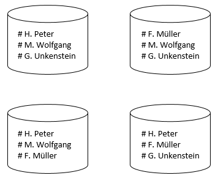
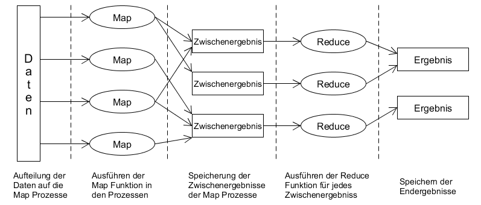

# Einführung

* CAP-Theorem/BASE/ACID
* Skalierung
	* Vertikal
	* Horizontal
* Replication
* Sharding
* Clustering
* Hashing
* Map-Reduce
* In Memory Datenbanken

## ACID, BASE und das CAP-Theorem
### ACID [1-2,12-23]
Ein wichtiger Aspekt einer jeden Datenbank ist ihr Transaktionskonzept. Viele der altbekannten relationalen Datenbanken setzen hier auf das ACID Prinzip um die Integrität der Daten zu gewährleisten. Eine Transaktion ist dabei beliebige Folge zusammenhängender Verarbeitungsschritte aus den Grundoperationen Create, Read, Update und Delete (CRUD). Damit mehrere Nutzer mit einer Datenbank arbeiten können ohne dabei Konflikte in den Daten hervorzurufen, müssen die Transaktionen bestimmten Regeln folgen. Im Falle von ACID müssen sie daher folgende Eigenschaften einhalten:

* Atomarität (A=Atomicity): Eine Transaktion ist atomar, wenn sie in ihrer Gesamtheit entweder ganz oder gar nicht ausgeführt wird (Alles oder nichts Prinzip). Folglich müssen die einzelnen Operationen einer Transaktion komplett und ohne Fehler durchlaufen um einen neuen Ergebniszustand zu erreichen. Tritt jedoch ein Fehler während der Transaktion auf, wird der Zustand der Datenbank auf den Anfangszustand zurückgesetzt, den sie zu Beginn der Transaktion hatte. Alle Operationen der fehlerhaften Transaktion werden somit ungültig und bereits durchgeführte rückgängig gemacht. 
* Konsistenz (C=Consistency): Eine Transaktion muss die Datenbank von einem konsistenten Anfangszustand in einen konsistenten Endzustand überführen. Um Konsistent zu sein, muss die Integrität und Plausibilität der Daten gewährleistet sein, beispielsweise müssen Beziehungen über Fremd- und Primärschlüssel korrekt sein. Kann kein konsistenter Zustand nach dem Ausführen der Transaktion hergestellt werden, so wird die gesamte Transaktion als ungültig deklariert. Die Datenbank wird dann auf den Zustand vor Beginn der Transaktion zurückgesetzt.
* Isolation (I=Isolation): Isolation sagt aus, dass Transaktionen vollkommen getrennt voneinander ablaufen. Gleichzeitig ablaufende Transaktionen liefern somit dieselben Resultate, so als würden sie sequentiell hintereinander ausgeführt werden. Es soll damit verhindert werden, dass Transaktionen sich gegenseitig beeinflussen und beispielsweise nicht zwei gleichzeitig denselben Datenwert ändern.
* Dauerhaftigkeit (D=Durability): Jede erfolgreiche Transaktion setzt die Datenbank in einen dauerhaften Zustand, der sich erst ändert, wenn eine neue Transaktion durchgeführt wurde. Diese Dauerhaftigkeit muss auch bei Systemabstürzen gewährleistet sein.

Es ist ersichtlich, dass die Einhaltung des ACID Prinzips vor allem die Konsistenz der Daten zum Ziel hat. In der heutigen Zeit spielen bei verteilten Datenbanksystemen allerdings noch zwei weitere Aspekte eine Rolle: Verfügbarkeit (Antwortzeiten) und Ausfalltoleranz.

### CAP [1-2,12-14,23-28]
* Konsistenz (C=Consistency): Bei verteilten Datenbanksystemen mit replizierten Knoten muss für die Konsistenz sichergestellt werden, dass bei Änderung der Daten auf einem Knoten alle folgenden Transaktionen auch mit diesen veränderten Werten arbeiten, selbst wenn sie mit einem anderen Knoten arbeiten.
* Verfügbarkeit (A=Availability): Verfügbarkeit bezeichnet die Fähigkeit ununterbrochen auf die Datenbank in angemessener Zeit zugreifen zu können.
* Ausfalltoleranz (P=Partition Tolerance): Ausfalltoleranz besagt, dass der Ausfall eines (oder mehrerer) Knoten eines verteilten Datenbanksystems, oder der Ausfall von Verbindungen zwischen den Knoten nicht den Ausfall des Gesamtsystems zur Folge hat. 

Optimal wäre es, wenn alle drei Aspekte, Konsistenz, Verfügbarkeit und Ausfalltoleranz gleichzeitig im vollen Umfang erreicht werden könnten. Es hat sich jedoch gezeigt, dass dies innerhalb von verteilten Datenbanksystemen nicht möglich ist und sich immer nur zwei der drei Aspekte umsetzen lassen. Dieses Theorem wird dabei als CAP-Theorem bezeichnet. In der folgenden Abbildung ist das CAP-Theorem und die Tatsache, dass immer nur zwei Aspekte umgesetzt werden können, als Dreieck dargestellt.

  

Je nachdem welche zwei der drei Anforderungen an die Datenbank gestellt werden, werden diese Systeme als CA (Konsistenz und Verfügbarkeit), CP (Konsistenz und Ausfalltoleranz) oder AP (Verfügbarkeit und Ausfalltoleranz) Systeme bezeichnet. Da traditionelle relationale Datenbanksysteme wie bereits erwähnt meist die Konsistenz als oberstes Ziel haben, lassen sie sich als CA/CP Systeme bezeichnen. Viele NoSQL Datenbanksystem haben jedoch einen viel stärkeren Fokus auf die Verfügbarkeit oder Ausfalltoleranz, die Konsistenz spielt dabei keine so große Rolle. Für diese Systeme ist es ausreichend, wenn die Konsistenz der Daten nach einer Änderung erst im Laufe der Zeit wiederhergestellt ist.

### BASE [1-2,12-14,23,25,29-30]
Diese Eigenschaft wird dabei auch häufig als BASE Model (Basically Available, Soft State, Eventually Consistent) bezeichnet. Bei BASE wird die Verfügbarkeit über die Konsistenz gestellt und es gilt des Öfteren als Gegenstück zu ACID.   
Die Verfügbarkeit wird dabei beispielsweise durch eine große Anzahl an Knoten erreicht (Basically Available).  
Eine Änderung der Daten in einem Knoten hat dabei nicht zur Folge, dass die Änderungen direkt allen anderen Knoten mitgeteilt wird, sondern nur schrittweise. Es kann somit passieren, dass zwei Nutzer beim Lesen derselben Daten zwei unterschiedliche Datenwerte erhalten (Soft State).   
Irgendwann haben jedoch alle Knoten die Änderungen verarbeitet und die Datensätze sind wieder konsistent (Eventually Consistent).   

## Skalierung [2-7]
Unter Skalieren versteht man die Eigenschaft eines Systems, sich an verändernde (meist wachsende) Ansprüche anzupassen. Im Bereich der Datenbanken kann beispielsweise der verfügbare Speicherplatz oder die Zugriffsgeschwindigkeit auf Daten eine Rolle spielen. Eine Verbesserung eines Systems kann dabei auf zwei verschiedene Arten erfolgen:  

* Vertikale Skalierung (Scale-Up)  
Von einer vertikalen Skalierung spricht man, wenn das vorhandene System durch bessere Hardware/Komponenten aufgerüstet wird. Dies kann beispielsweise durch Hinzufügen einer CPU oder das Austauschen der alten durch eine neue erfolgen, um die Leistung des Systems zu erhöhen. Vergrößerung des Speicherplatzes kann durch Hinzufügen einer weiteren Festplatte erfolgen.
* Horizontale Skalierung (Scale-out)  
Von horizontaler Skalierung ist die Rede, wenn das vorhandene System durch Hinzufügen neuer Ressourcen Einheiten (Rechner/Server) erweitert wird. 

  

In der Abbildung ist das Prinzip der vertikalen und horizontalen Skalierung anhand des Beispiels eines Datenbanksystems dargestellt. Zu Beginn existiert ein Server, bei der vertikalen Skalierung wird dieser durch bessere Komponenten aufgerüstet, bei der horizontalen Skalierung werden weitere Server hinzugefügt.  
Der Nachteil bei einer vertikalen Skalierung besteht darin, dass sie irgendwann an ihre Grenzen stößt. Wenn bereits die besten Komponenten, die auf dem Markt zu finden sind, verwendet werden, kann keine Verbesserung mehr erfolgen. Der Vorteil ist jedoch, dass meist keine Änderungen beispielsweise an der Anwendungssoftware durchgeführt werden müssen, da die Struktur des Systems gleich bleibt. Bei horizontaler Skalierung können Änderungen jedoch von Nöten sein, wenn Software stark an die bisherige Struktur angepasst ist. Viele NoSQL-Datenbanken haben dieses Problem jedoch nicht, da sie auf diese Art der Skalierung ausgelegt sind und Mechanismen dafür bieten.

## Clustering, Replikation, Sharding und Hashing

### Clustering [1-2,12-14,44-47,]
Das Zusammenfassen mehrerer einzelnen Rechner/Server zu einem System wird im allgemeinen als Clustering bezeichnet. Je nach Einsatzgebiet und genutzter Technologie kann dieses System dabei einen unterschiedlichen Aufbau haben. Beispielsweise kann es einen Master und mehrere Slaves geben, oder es können mehrere gleichberechtigte Knoten existieren. Im allgemeinen ist der Vorteil eines Clusters jedoch, dass eine Lastverteilung stattfinden kann. Ist ein Knoten stark ausgelastet, können seine Aufgaben an andere Knoten im System verteilt werden. Auch können Aufgaben, die an das System gestellt werden, direkt an den Knoten geleitet werden, der zurzeit am wenigsten ausgelastet ist. Ein weiterer Vorteil besteht meist auch in einer verbesserten Ausfallsicherheit. Fällt ein Knoten aus, können die anderen Knoten des Systems diesen Ausfall kompensieren.  

### Replikation [1-2,12-14,44-47,]
Als Replikation wird das Speichern gleicher Datenbestände auf mehrere Knoten im System bezeichnet. Auch hier kann es je nach Datenbankmanagementsystem unterschiedliche Anwendungen dieses Prinzips geben. Alle Knoten des Systems können beispielsweise alle die selben Daten besitzen und jede Änderung untereinander aktualisieren. Auch ist es möglich, dass es einen Master gibt, der für alle Schreibzugriffe zuständig ist und seine Datenbestände an die Slaves weitergibt. Leseanfragen können dabei über die Slaves abgearbeitet werden. Eine weitere Möglichkeit ist, dass nicht jeder Knoten die selben Daten hält, sondern jeder hält immer nur einen bestimmten Teil der Daten, sodass am Ende ein bestimmter Datensatz zwar des öfteren im Gesamtsystem vorkommt, aber nicht auf jedem einzelnen Knoten. Häufig wird dabei mit einer Replikationsrate von drei oder fünf gearbeitet, soll heißen ein bestimmter Datensatz ist auf drei, bzw. fünf verschiedenen Knoten im Clustersystem vorhanden. In der folgenden Abbildung ist ein kleines Beispiel mit einer Replikationsrate von drei dargestellt.

  

Vorteile der Replikation bestehen in der verbesserten Ausfallsicherheit und kürzeren Antwortzeiten. Fällt ein Knoten aus kann dennoch auf die betroffenen Datensätze zugegriffen werden, da diese auch von anderen Knoten gespeichert werden. Durch die Verteilung der Daten an verschiedene Orte kann eine bessere Lastverteilung stattfinden und dementsprechend die Antwortzeiten verringert werden. Probleme bestehen jedoch immer bei der Konsistenzbewahrung. Änderungen auf einem Knoten müssen auf alle anderen betroffenen Knoten übertragen werden.  
### Sharding [1-2,12-14,44-47,]

### Hashing [1-2,12-14,44-47,]

## Map-Reduce [1-2,12-14,31-43]
Durch den Bereich Big-Data wird es immer wichtiger, sehr große verteilte Datenmengen verarbeiten zu können. Da dies auch in angemessener Zeit erfolgen soll, ist es von Vorteil wenn die Datenverarbeitung parallel ausgeführt wird. Um dies umzusetzen wurde von Google das Map-Reduce Framework entwickelt.  
Die Funktionsweise von Map-Reduce lässt sich in verschiedene Phasen untergliedern und ist in der folgenden Abbildung dargestellt.

  

* Im ersten Schritt werden die Daten auf die verschiedenen Knoten im Netz verteilt, die auch die Map-Funktionen ausführen.
* Anschließend werden in den verschiedenen Prozessen parallel die vom Nutzer spezifizierte Map-Funktion ausgeführt.
* Die Ergebnisse der Map-Prozesse werden dann in unterschiedlichen Zwischenergebnissen gespeichert.
* Daraufhin wird für jedes Zwischenergebnis ein Reduce Prozess gestartet, die dann die vom Nutzer definierte Reduce-Funktion ausführen.
* Im letzten Schritt werden dann alle Ergebnisse der Reduce-Prozesse gespeichert.
  
Da das Framework die Aufteilung und Parallelisierung der Daten und Prozesse übernimmt, muss der Nutzer selbst nur die Map und Reduce Funktionen angeben. Diese spezifizieren dann die gewünschte Logik. Dabei wird mit Key-Value Wertepaaren gearbeitet. In der Map Phase können beispielsweise die Vorkommnisse einzelner Wörter gesammelt werden. In der Reduce Phase können dann Aggregationen durchgeführt werden, beispielsweise um Durchschnittswerte zu berechnen.  
Es gibt einige NoSQL Datenbanksysteme, die das Map-Reduce Prinzip nutzen, um mit verteilten Datensätzen zu arbeiten. Häufig muss dabei keine Verteilung der Daten mehr stattfinden, da diese bereits auf verschiedene Knoten verteilt sind. Jeder Serverknoten kann daher für seine eigenen Datensätze die Map-Funktion ausführen.
## In Memory Datenbanken [8-11,14]
Klassischerweise werden Daten jeglicher Art meist auf Festplatten gespeichert. Dies ist auch generell bei Relationalen Datenbankmanagementsystemen der Fall, die Datenbank, bzw. die entsprechenden Daten werden auf Festplattenlaufwerke gespeichert. Es gibt jedoch auch eine andere Möglichkeit Daten zu speichern: Die Speicherung im Arbeitsspeicher (RAM). Datenbanken die ihre Daten innerhalb des RAM speichern werden als In-Memory Datenbanken bezeichnet. Es gibt einige NoSQL Systeme, die diese Art der Datenhaltung nutzen.  
Die Speicherung der Daten im Arbeitsspeicher hat den Vorteil, dass Zugriffsgeschwindigkeiten deutlich besser sind als im Vergleich zum Festplattenspeicher. Lese- und Schreiboperationen auf den Arbeitsspeicher sind deutlich schneller als auf Festplattenspeicher. Häufig finden In-Memory Datenbanken daher Anwendung im Big-Data Bereich, da dort mit sehr großen Mengen an Daten gearbeitet wird, die analysiert und ausgewertet werden müssen. Ein Nachteil ist im Allgemeinen jedoch die Tatsache, dass Arbeitsspeicher nur flüchtig ist. Ein Absturz des Systems führt daher dazu, dass alle Daten, die im Arbeitsspeicher gehalten wurden, verloren gehen. Eine dauerhafte Speicherung der Daten (Persistenz) ist somit nicht möglich. Es gibt jedoch Möglichkeiten, wie eine Persistente Datenhaltung trotzdem erreicht werden kann:  

* Es können Schnappschuss-Dateien erstellt werden, die den Zustand der Datenbank zum Zeitpunkt des Schnappschuss vollständig erfassen. Diese Dateien können dann auf einem persistenten Speichermedium gespeichert werden. Der Nachteil bei dieser Variante ist, dass bei einem Systemabsturz alle Änderungen der Daten zwischen dem letzten Schnappschuss und dem Ausfall verloren gehen.
* Zusätzlich zum Anlegen von Schnappschüssen kann ein Protokoll geführt werden. Dieses speichert alle Änderungen, die an den Daten der Datenbank vollzogen werden. Somit kann bei einem Absturz mithilfe des Schnappschuss und des Protokolls der Zustand der Datenbank wiederhergestellt werden. 
* Eine weitere Möglichkeit ist das Nutzen von nichtflüchtigem RAM Speicher (NVRAM). Die Datenhaltung im RAM wird dabei durch einen Energiespeicher, beispielsweise eine Batterie, sichergestellt, bis das System wieder am Laufen ist. 

Da Arbeitsspeicher jedoch deutlich teurer ist im Vergleich zu Festplattenspeicher werden häufig auch Hybride Ansätze genutzt. Die Daten der Datenbank können dabei sowohl im Arbeitsspeicher, als auch auf der Festplatte gespeichert werden. 