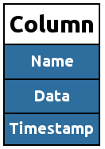

# Spaltenorientierte Datenbanken [1-2,12-14,72,98-106]
Spaltenorientierte Datenbanken (auch Wide-Column-Stores genannt) speichern ihre Daten, vereinfacht gesagt, nicht wie relationale Datenbanken in Zeilenform, sondern in Spaltenform. Eine relationale Datenbank würde Datensätze beispielsweise auf folgende Weise speichern:  

1,Peter,40000  
2,Maria,45000  
3,Dieter,35000  

Der erste Wert stellt dabei eine ID dar, der zweite den Namen der Person und der dritte das Gehalt.  
Eine spaltenorientierte Datenbank würde die gleichen Datensätze auf folgende Weise speichern:  

1,2,3  
Peter,Maria,Dieter  
40000,45000,35000  

Dies ist zwar nur ein sehr vereinfachtes Beispiel, da die tatsächliche Art der Speicherung von spaltenorientierten Datenbanken anders umgesetzt ist, es zeigt jedoch direkt den Nutzen einer solchen Form der Datenstrukturierung. Würde man beispielsweise das Durchschnittsgehalt aller Personen berechnen wollen, so wird bei relationalen Datenbanken zuerst der erste Datensatz ausgewählt werden und in diesem dann der dritte Wert, der das Gehalt beschreibt. Dasselbe müsste für den zweiten und dritten Datensatz geschehen. Bei spaltenorientierten Datenbanken müsste nur der dritte Datensatz ausgewählt und all seine Werte gelesen werden. Statt auf drei muss also nur auf ein Datensatz zugegriffen werden, was deutlich schneller ist.

## Funktionsweise
Die tatsächliche Art der Speicherung der Daten unterscheidet sich teilweise bei den verschiedenen Anbietern. Im allgemeinen gibt es jedoch Spalten, die einen Namen besitzen, die Daten halten und einen Zeitstempel haben. Die Struktur einer Spalte ist in folgender Abbildung dargestellt [99].

  [99]  

Spalten die ähnliche oder verwandte Inhalte speichern können in einer Column Family zusammengefasst werden. Beispielsweise könnten alle Spalten, die eine Person beschreiben, Teil einer Column Family werden, was in folgender Abbildung abgebildet ist [99].

  [99]  

Eine solche Column Family hat dabei keine logische Struktur und kann sogar aus Millionen Spalten bestehen.

## Vorteile
Wie bereits durch das Beispiel deutlich wurde, sind spaltenorientierte Datenbanken besonders dafür geeignet Aggregate von Daten zu bilden, wie beispielsweise der Durchschnittswert oder Minima/Maxima. Dadurch, dass die Daten einer Spalte zusammen gespeichert werden, ist der Zugriff darauf bei spaltenorientierten Datenbanken deutlich schneller als bei relationalen Datenbanken. Auch das Ändern von allen Daten einer Spalte, beispielsweise bei einer allgemeinen Gehaltserhöhung ist deutlich effizienter. Des Weiteren lassen sich Daten in einer spaltenorientierten Datenbank leichter komprimieren. Allgemein sind sie also gut für Einsatzzwecke wie analytische Informationssysteme und Finanzberichte.

## Nachteile
Der Nachteil dieser Datenbanken ist jedoch, dass Zugriffe auf alle Attribute eines Objekts, also eine Zeile, dementsprechend deutlich langsamer sind. Das Hinzufügen neuer Datensätze, beispielsweise ein neuer Mitarbeiter, ist bei spaltenorientierten Datenbanken deutlich weniger effizient als bei relationalen Datenbanken. 

## Anbieter [107]
Die am häufigsten genutzten Spaltenorientierten Datenbanken laut db-engines.com (Stand Juni 2017)

* Cassandra: 124,12 Punkte
* HBase: 61,87 Punkte
* Microsoft Azure Cosmos DB: 6,38 Punkte